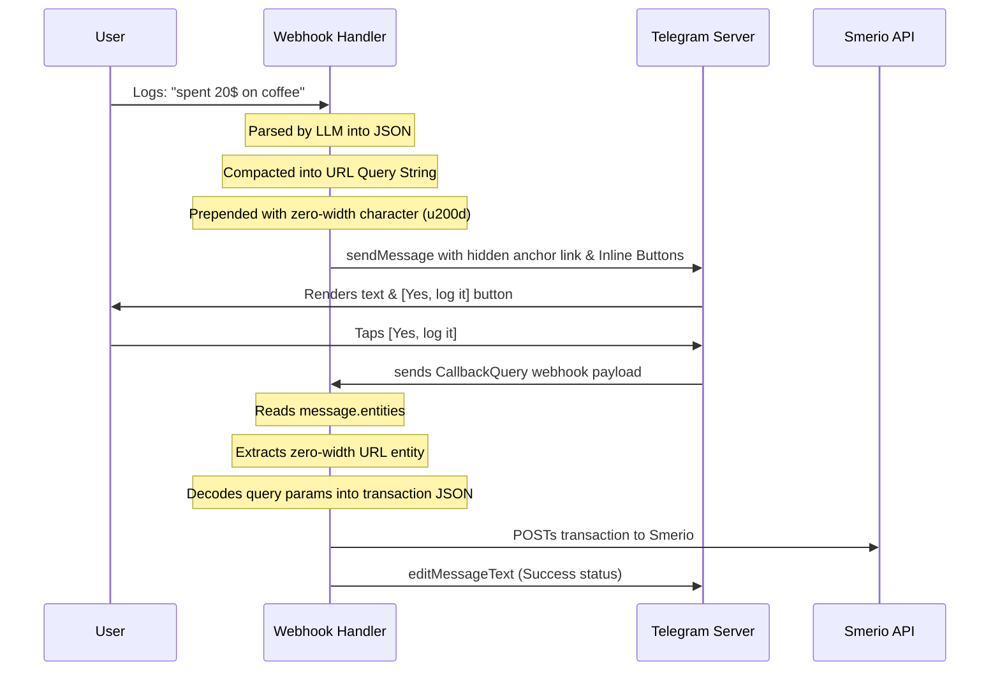

# Pattern: Zero-Width Stateless Callback Payload Ingestion

This document details the software engineering pattern designed to bypass the strict **64-byte payload limit** of Telegram's inline button `callback_data` payloads, enabling **100% database-free, zero-cost, and stateless confirmation flows** within conversational interfaces.

---

## 🛑 The Problem: Callback Data Limits
When designing interactive chat dialog cards (e.g. asking a user to confirm details parsed from an expense message or receipt photo), we want to show inline action buttons like:
`[✅ Confirm and Log]`  `[❌ Cancel]`

When clicked, the callback payload must tell the server exactly what transaction to write (including fields like category, subcategory, amount, currency, notes, etc.). However:
* Telegram's `callback_data` property is strictly capped at **64 characters**.
* Storing the transaction state in an external database (e.g. AWS DynamoDB, Redis, Postgres) introduces:
  1. Significant AWS infrastructure complexity.
  2. Database hosting costs.
  3. Session/state cleanup schedules.
  4. Increased API round-trip latency.

---

## 💡 The Solution: Zero-Width Text Entity Hiding
To maintain complete statelessness, we encode the full transactional state inside the message itself, making it completely invisible to the user but fully discoverable by the webhook parser.

### Architectural Flow



---

## 🛠️ Implementation Details (Python)

### 1. The Encoder (Packing the State)
We serialize our target state dictionary into standard HTTP URL query parameters, compacting keys to minimize length, and prepend a zero-width space entity (`\u200d`) containing the URL.

```python
import urllib.parse

def encode_payload(transaction_dict: dict) -> str:
    """
    Serializes transaction details into a compact query parameter string, 
    wrapped in an invisible, zero-width URL anchor.
    """
    # Use compact keys to save space
    compact_data = {
        "cat": transaction_dict.get("category", ""),
        "sub": transaction_dict.get("subcategory", ""),
        "amt": transaction_dict.get("amount", 0.0),
        "cur": transaction_dict.get("currency", "USD"),
        "not": transaction_dict.get("notes", ""),
        "typ": transaction_dict.get("type", "Expense")
    }
    
    # Generate query parameter string
    query_string = urllib.parse.urlencode(compact_data)
    
    # Combine with a dummy hostname and enclose in zero-width anchor markup
    hidden_url = f"https://smer.io/tx?{query_string}"
    
    # Prepend the zero-width character (\u200d) acting as the visible link text
    return f'<a href="{hidden_url}">\u200d</a>'
```

### 2. Rendering the Telegram Message
By setting the `parse_mode` to `"HTML"`, Telegram renders the `\u200d` zero-width character invisibly to the human eye, but registers it as a valid `text_link` entity.

```python
# Constructing the message body
hidden_link = encode_payload(tx_details)
message_text = f"{hidden_link}📝 Log this transaction for *{tx_details['amount']} {tx_details['currency']}* under *{tx_details['category']}*?"

# Send via sendMessage API
# The hidden link is prepended, occupying 0 pixels of screen space.
```

### 3. The Decoder (Unpacking the State on Click)
When the user taps the inline action button, Telegram sends a `callback_query` containing the full `message` object. The webhook handler scans the `message.entities` array to locate the `text_link` type, extracts the URL, parses the query string, and reconstructs the transaction payload.

```python
def decode_payload(message_dict: dict) -> dict:
    """
    Extracts, decodes, and parses the zero-width URL payload embedded 
    in the message entities back into a clean transaction dictionary.
    """
    entities = message_dict.get("entities", [])
    for ent in entities:
        if ent.get("type") == "text_link":
            url = ent.get("url", "")
            if "smer.io/tx" in url:
                parsed_url = urllib.parse.urlparse(url)
                params = urllib.parse.parse_qs(parsed_url.query)
                
                # Unpack and map compact keys back to full schema
                return {
                    "category": params.get("cat", [""])[0],
                    "subcategory": params.get("sub", [""])[0],
                    "amount": float(params.get("amt", [0.0])[0]),
                    "currency": params.get("cur", ["USD"])[0],
                    "notes": params.get("not", [""])[0],
                    "type": params.get("typ", ["Expense"])[0]
                }
    raise ValueError("Stateless callback metadata entity not found in message.")
```

---

## ⚡ Benefits
* **Absolute Zero Infrastructure Cost**: Bypasses the need for storage layers entirely, keeping the application footprint serverless, fast, and light.
* **Resilient to Timeouts**: The state is stored directly within the chat message. It never expires, eliminating database session timeout issues.
* **Safe and Private**: The payload is stored as metadata on Telegram's secure servers, visible only as an invisible anchor block, making it secure and fully isolated.
